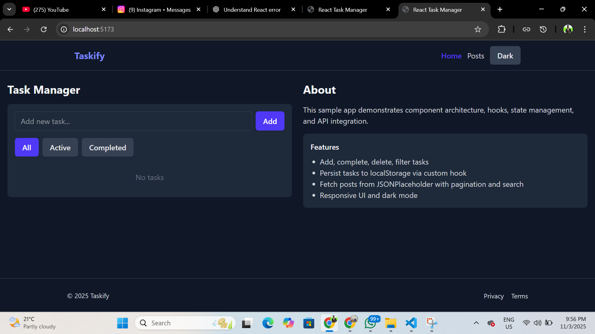
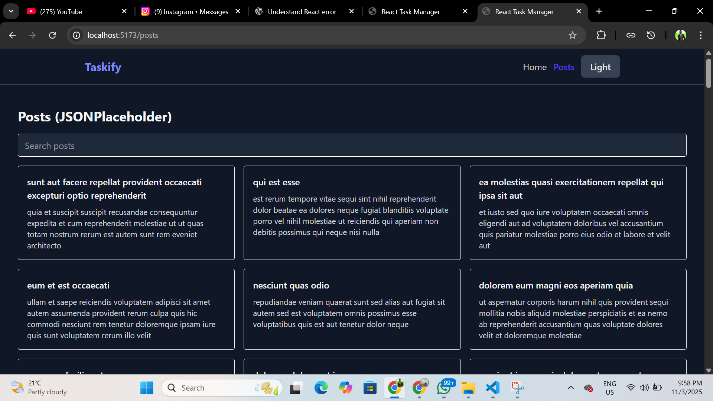
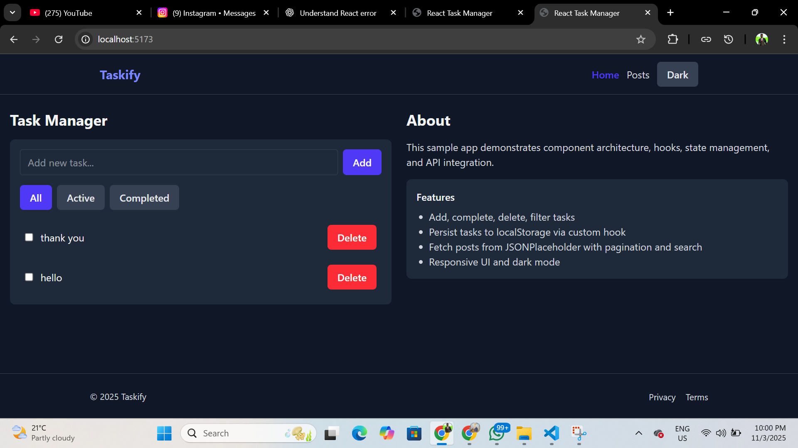

1. Node.js 18+ installed
2. npm install
3. npm run dev

This scaffold contains:
- Reusable components: Button, Card, Navbar, Footer
- Layout wrapper
- Task manager with localStorage persistence
- Posts page that fetches from JSONPlaceholder with pagination
- Theme context and dark mode via Tailwind's class strategy

